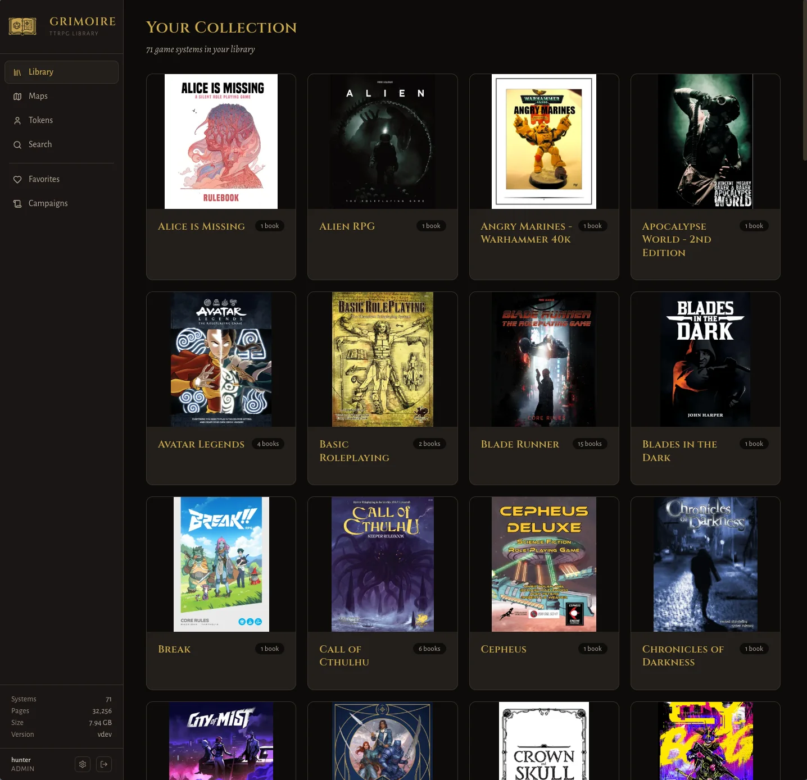

# Grimoire Unraid Community Applications Template

This repository provides an unofficial **Unraid Community Applications** template for [Grimoire](https://github.com/hunter-read/grimoire) — a self-hosted organizer for your TTRPG content and campaigns.

## What is Grimoire?

Grimoire is a beautiful, responsive web app for managing your tabletop RPG library:
- Full-text search across every page of your PDFs
- Page-by-page PDF viewer with mobile support
- Maps, tokens, and audio browser with tagging and playback
- Campaign management with markdown wiki
- OPDS catalog for e-readers
- Bookmarks, favorites, metadata editing, and more

## Installation

1. Install the **Community Applications** plugin in Unraid (if not already installed).
2. Search for **"Grimoire"** in the Apps tab.
3. Configure the paths:
   - **Library Path**: Point to your TTRPG collection (e.g. `/mnt/user/media/ttrpg`)
   - **Data Path**: Appdata location for database & thumbnails (e.g. `/mnt/user/appdata/grimoire`)
   - **Secret Key**: Generate a strong secret key with `openssl rand -hex 32`

## Links

- **Project Repository**: [hunter-read/grimoire](https://github.com/hunter-read/grimoire)
- **Docker Image**: `hunterreadca/grimoire:latest`
- **Documentation**: See the main Grimoire README
- **Support**: [GitHub Issues](https://github.com/hunter-read/grimoire/issues)

## Screenshot

---

*Template maintained for the Unraid Community.*